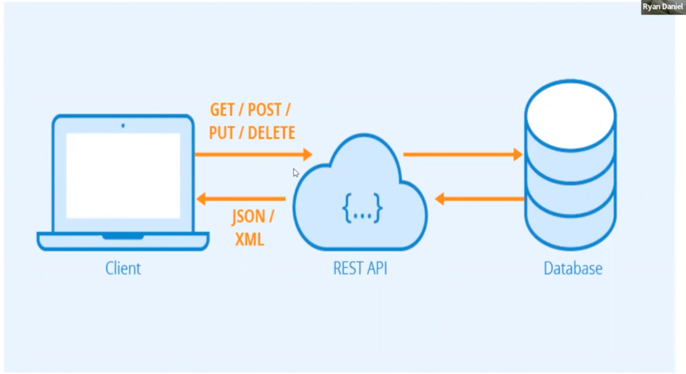
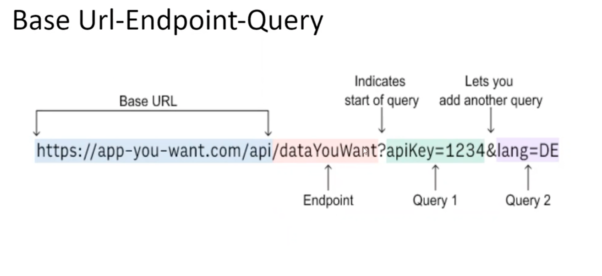

# POSTMAN nedir???
 - Backend tarafından veriyi test etmek için kullanılır...

# API nedir?
- Authenticatian and Authorize
  - Kimlik doğrulama - Yetki
  bunu nasıl sağlarız.API KEY VEYA TOKEN ler yoluyla bu test edilebilir.
- Database HTTP (Hyper Text Transfer Protocol) requests iletiriz.Response elde ederiz.
- Bir uygulamanın birden fazla veri almak gerekirse;
- Ara katman 
- Bir uygulamanın direkt database bağlanması çok güvenlikli değildir.
- OSI Reference Model ---Session Layer

# RESTFUL API ()
- Uniform İnterface(Data alışverişinin kolay olması)
- Staless (kişisel verileri ilgilenmiyor token validse veriyi veriyor.Kullanıcımın yetkisini kontrol eder)
- Cacheable (serverden gelen hafıza tutarak yinelenlerde daha hızlı giriş sağlar.Ön bellek)
- Client-Server (Request-Response--Client server tarafındaki verilere ulaşmamıyor.)
- Layered System (Web,Phone hepsine cevap veren uygulama)
- Code on Demand(optional)
- Actions=HTPP commands
  - GET (VERİYİ AL) >>SQL =>SELECT
  - POST (VERİ GÖNDER)>> İNSERT
  - PUT(UPDATE)
  - DELETE

  

## BASE URL
  

# SOAP API